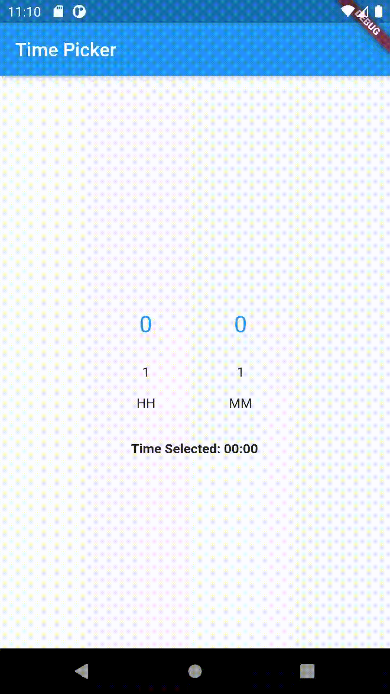

# time_picker

This is a time picker library in which you can set an interval in HH:MM. It can be used to pick interval using a slider type definition.

## Usage

```dart

// add immediately after class definition
int _hour = 0;
int _minute = 0;

void _fetchValues(int newHour, int newMinute) {
  setState(() {
    _hour = newHour;
    _minute = newMinute;
  });
}


// use in render
TimePicker(fetchValues: _fetchValues)
```

## Demo


